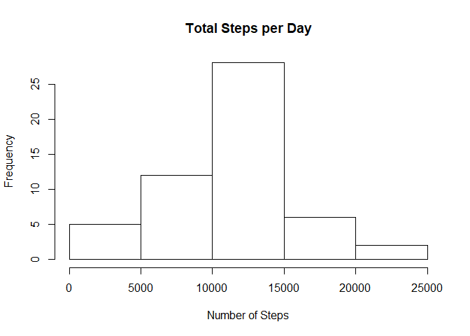
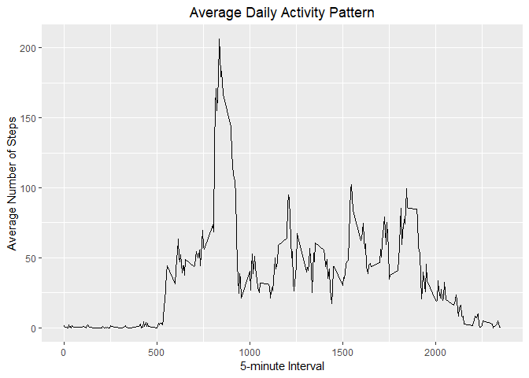
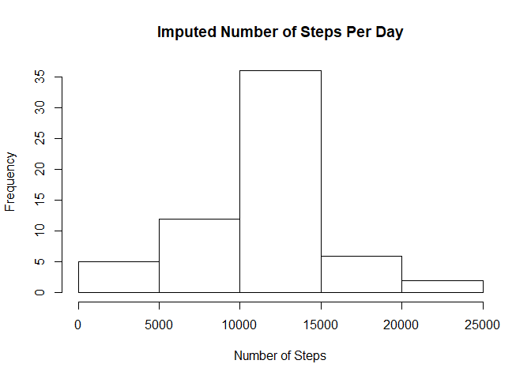
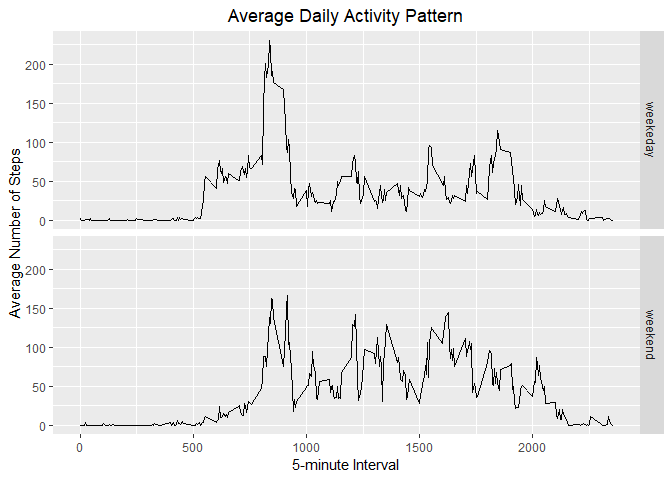

Q1. Loading and preprocessing the data
======================================

    library(ggplot2)
    stepsdata <- read.csv(file="activity.csv", header=TRUE)
    summary(stepsdata)

    ##      steps                date          interval     
    ##  Min.   :  0.00   2012-10-01:  288   Min.   :   0.0  
    ##  1st Qu.:  0.00   2012-10-02:  288   1st Qu.: 588.8  
    ##  Median :  0.00   2012-10-03:  288   Median :1177.5  
    ##  Mean   : 37.38   2012-10-04:  288   Mean   :1177.5  
    ##  3rd Qu.: 12.00   2012-10-05:  288   3rd Qu.:1766.2  
    ##  Max.   :806.00   2012-10-06:  288   Max.   :2355.0  
    ##  NA's   :2304     (Other)   :15840

Q2. What is mean total number of steps taken per day?
=====================================================

### 1. Calculate the total steps taken per day

    totalsteps <- sum(stepsdata$steps, na.rm = TRUE)
    totalsteps

    ## [1] 570608

    totalSteps <- aggregate(steps ~ date, stepsdata, FUN=sum)

### 2. Make a histogram

### 3. Calculate Mean & Median

    meanSteps <- mean(totalSteps$steps, na.rm = TRUE)
    meanSteps

    ## [1] 10766.19

    medSteps <- median(totalSteps$steps, na.rm = TRUE)
    medSteps

    ## [1] 10765

Q3. What is the average daily activity pattern
==============================================

### 1. Make a time-series plot of the 5-minute interval and the average number of steps taken, averaged acoss all days.

### 2. Which 5-minute interval across all days contain the maximum number of steps

    maxInt <- meanStepsByInt[which.max(meanStepsByInt$steps),]
    maxInt

    ##     interval    steps
    ## 104      835 206.1698

Q4. Imputing missing values
===========================

### 1. Calculate and report the total number of missing values in the dataset

    missingVals <- is.na(stepsdata$steps)
    summary(missingVals)

    ##    Mode   FALSE    TRUE 
    ## logical   15264    2304

### 2. Devise a strategy for filling in all of the missing values.

    #We use the strategy to replace each NA value by the mean of the steps attribute.

### 3.Create a new dataset that is equal to the original dataset but with the missing data filled in.

    newdata <- transform(stepsdata,
                                  steps = ifelse(is.na(stepsdata$steps),
                                                 meanStepsByInt$steps[match(stepsdata$interval, 
                                                                            meanStepsByInt$interval)],
                                                 stepsdata$steps))
    summary(newdata)

    ##      steps                date          interval     
    ##  Min.   :  0.00   2012-10-01:  288   Min.   :   0.0  
    ##  1st Qu.:  0.00   2012-10-02:  288   1st Qu.: 588.8  
    ##  Median :  0.00   2012-10-03:  288   Median :1177.5  
    ##  Mean   : 37.38   2012-10-04:  288   Mean   :1177.5  
    ##  3rd Qu.: 27.00   2012-10-05:  288   3rd Qu.:1766.2  
    ##  Max.   :806.00   2012-10-06:  288   Max.   :2355.0  
    ##                   (Other)   :15840

### 4.Make a histogram of the total number of steps taken each day and report the mean and median.

    impStepsByInt <- aggregate(steps ~ date, newdata, FUN=sum)

    impMeanSteps <- mean(impStepsByInt$steps, na.rm = TRUE)
    impMedSteps <- median(impStepsByInt$steps, na.rm = TRUE)
    #New Mean
    impMeanSteps

    ## [1] 10766.19

    #New Median
    impMedSteps

    ## [1] 10766.19

    #Difference in Mean
    diffMean = impMeanSteps - meanSteps
    diffMean

    ## [1] 0

    #Difference in Median
    diffMed = impMedSteps - medSteps
    diffMed

    ## [1] 1.188679

    #Total Difference
    diffTotal = sum(impStepsByInt$steps) - sum(totalSteps$steps)
    diffTotal

    ## [1] 86129.51

Q5. Are there differences in activity patterns between weekdays and weekends?
=============================================================================

### 1. Create a new factor variable in the dataset with two levels - "weekend" and "weekday"

    DayType <- function(date) {
      day <- weekdays(date)
      if (day %in% c('Monday', 'Tuesday', 'Wednesday', 'Thursday', 'Friday'))
        return ("weekeday")
      else if (day %in% c('Saturday', 'Sunday'))
        return ("weekend")
      else
        stop ("Invalid Date Format.")
    }
    newdata$date <- as.Date(newdata$date)
    newdata$day <- sapply(newdata$date, FUN = DayType)

### 2. Make a panel plot containnig a time-series plot of the 5-minute interval and the average number of steps taken across all weekdays or weekends

    meanStepsByDay <- aggregate(steps ~ interval + day, newdata, mean)

Output created using the following code
=======================================

##### Since the document is R Markdown v2 document, use function rmarkdown::render

##### rmarkdown::render("PA1\_template.Rmd")
